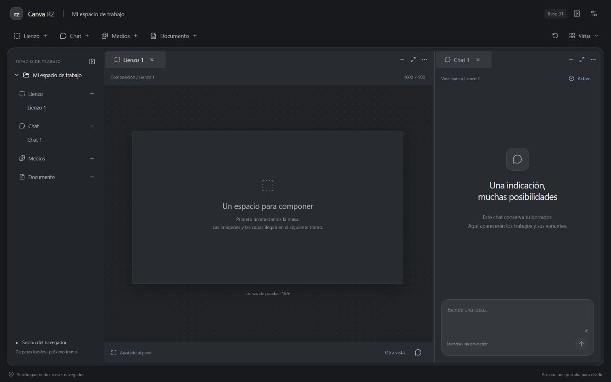
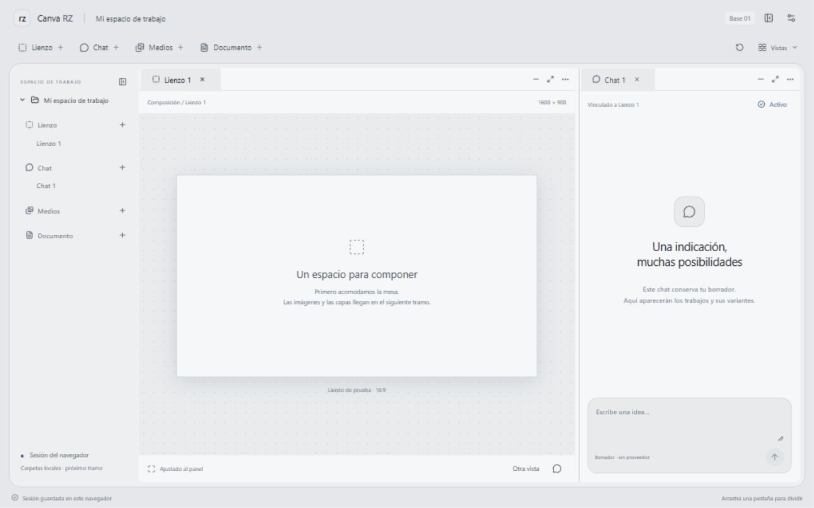
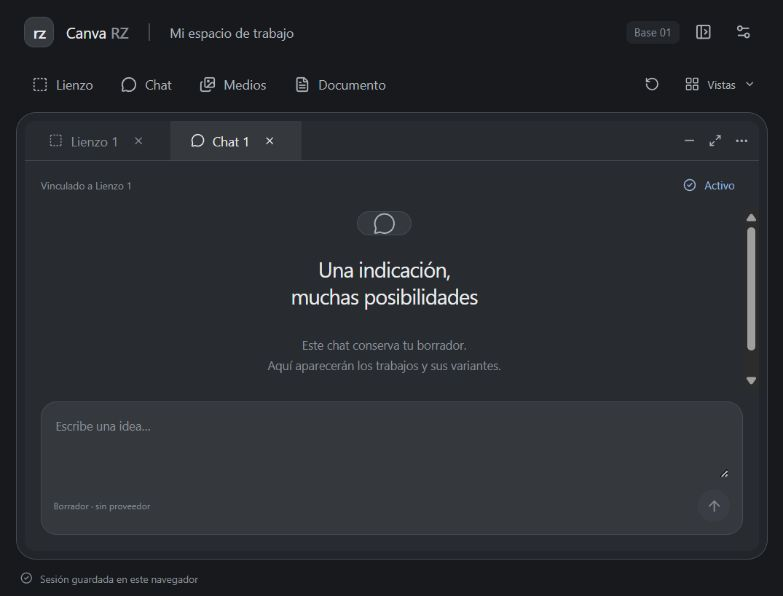

# Reporte 001 · Orquestación base de Canva RZ

30 de septiembre de 2026. Primera entrega de construcción conjunta.

## Resultado

Ya puedes abrir un marco web y alojar distintas herramientas en él. Esta entrega demuestra la organización de vistas antes de añadir edición por capas o proveedores. La nueva [ruta de construcción](../Plan.md) parte de tus dos notas, con [arquitectura](../Arquitectura.md), [requisitos trazados](../Requisitos.md) y [una ficha por frente](../modulos/00-marco.md).

La decisión principal es empezar por la mesa de trabajo: las herramientas tienen identidad propia y se conectan al anfitrión. El contenido, su vista y su ubicación se guardan por separado. Esto permite ampliar cada módulo sin tener que reconstruir el marco ni duplicar sus datos cuando abres otra vista.

## Qué puedes probar

| Operación | Cómo probarla | Qué conserva |
| --- | --- | --- |
| Abrir módulos | Botones Lienzo, Chat, Medios y Documento en la franja superior | Cada nueva instancia tiene su identidad |
| Mover/ordenar pestañas | Arrastrar la pestaña dentro de la barra o hacia otro panel | Contenido y vista |
| Dividir o agrupar | Menú de tres puntos del panel: derecha, debajo o agrupar | Los mismos borradores |
| Cambiar proporciones | Arrastrar la división entre paneles | Distribución al recargar |
| Ampliar/restaurar | Icono de ampliar en la cabecera del panel | La distribución previa |
| Ventana flotante | Tres puntos → Ventana flotante | Posición y borrador al recargar |
| Minimizar | Guion en cabecera; recuperar desde la franja inferior | Borrador y estado reducido |
| Cerrar/reabrir | X de pestaña; recuperar desde Vistas o el navegador | Contenido; cerrar no elimina |
| Dos vistas del mismo documento | En Documento, pulsar «Otra vista» | Ambas editan el mismo texto y revisión |
| Dos bibliotecas | Abrir Medios dos veces y usar búsquedas distintas | Filtro por vista, catálogo común |
| Chat activo | Abrir otro chat y pulsar Activar | Burbuja y vínculo usan ese chat |
| Burbuja breve | Vistas → Mostrar burbuja de chat | El mismo borrador del chat activo |
| Temas | Ajustes: oscuro/claro, intensidad y tonalidad | Preferencias y apariencia común |
| Navegador | Icono del encabezado para ocultarlo/mostrarlo | Estado en escritorio; drawer en estrecho |

En pantallas de hasta 900 px, el marco propone una sola área con pestañas al entrar desde una distribución amplia. Puedes reorganizarla con los controles; una distribución ya guardada para ese modo se recupera. En escritorio, «Ordenar paneles» ayuda a volver a una disposición dividida. Las herramientas pueden ocupar el área entera.

## Alcance real de los módulos de prueba

- **Lienzo:** artboard vacío de prueba, metadatos de demostración y vínculo al chat. Todavía no importa imágenes ni transforma capas.
- **Chat:** borrador persistente, selección explícita del chat activo y burbuja compartida. Enviar está deshabilitado porque no hay proveedor conectado.
- **Medios:** catálogo de borradores del navegador. Sirve para comprobar instancias y filtros; aún no escanea carpetas ni muestra una galería de medios reales.
- **Documento:** texto Markdown exacto, editable y compartido entre vistas. Aún no escribe un `.md` en el sistema de archivos ni ofrece formato de guion.

El estado se guarda durante la edición en este navegador. No equivale todavía a tu carpeta de proyecto compartida con otros programas. Si falla la escritura, la interfaz indica cambios sin guardar; no da una confirmación falsa.

## Base técnica

React, TypeScript y Vite; registro de módulos internos, núcleo independiente de la interfaz, adaptador de recuperación del navegador y sistema de tokens. [Dockview](https://dockview.dev/docs/overview/introduction/) resuelve distribución de pestañas y grupos; el anfitrión lo encapsula para que las herramientas no dependan de su formato. Las versiones exactas quedan fijadas en `package.json` y `package-lock.json`.

La tokenización tiene tres capas: valores básicos, roles de apariencia y asignación a componentes. El cambio de tema incluye marco, paneles, menús, textos, campos, bordes, foco y superficie del lienzo de prueba. El perfil táctil aumenta las áreas de interacción; las operaciones tienen alternativas al arrastre.

No hizo falta instalar una skill adicional de diseño: estas reglas y el sistema común están en el repo. Tampoco se fijó todavía el motor de lienzo, un backend Python ni un proveedor de generación. Sus contratos y puntos de conexión están definidos para elegirlos cuando lleguemos a su función concreta.

## Evidencia

`npm run build`: compilación TypeScript y web de producción satisfactorias. `npm test`: **7 pruebas aprobadas** en Chromium mediante Edge local.

Las pruebas cubren cierre/minimización/reapertura/recarga, documentos compartidos entre dos vistas, filtros independientes, división/agrupación/ampliación/flotación, chat activo y burbuja, preferencias/táctil, fallo de almacenamiento y adaptación estrecha conservando borrador. Además se comprobó visualmente el marco claro/oscuro y se arrastró el separador en el navegador integrado.

No son ensayos del editor ni de IA: no prueban exportación, máscaras, GPU, proveedores, carpetas o generación. El tamaño de tablet probado es de navegador; los gestos y rendimiento del iPad físico se comprobarán contigo. La compilación informa un chunk JavaScript de unos 632 kB antes de gzip (165 kB comprimido); optimizaremos carga por módulo si el uso lo requiere.

### Marco oscuro, escritorio

### Marco claro, misma distribución

### Marco estrecho, pestañas

## Trazabilidad y respaldo

Las [dos notas originales](../fuentes/Procedencia.md) se conservaron byte por byte en el orden indicado. El plan anterior se usó para contrastar cobertura; las nuevas fichas y secuencia son el diseño vigente. Los requisitos del lienzo, capas, gestos, color, historial, biblioteca, documentos, IA y ampliaciones siguen registrados.

Repositorio local propio dentro de `Canva-RZ`, separado de las aplicaciones de referencia y los archivos ajenos al desarrollo. Destino autorizado: https://github.com/ramon-david-rz/Canva-Rz. El remoto se consultó y no tenía referencias publicadas al conectar. Checkpoint: `base-001` en `main`; su publicación se verifica mediante comparación de hashes después del push. Dependencias instaladas, compilados y datos temporales están excluidos de Git.

## Tu siguiente intervención

Primero prueba la mesa: proporciones, pestañas, minimizar/reabrir, navegador y tema. Indica lo que te resulte incómodo o qué prefieres mover. El siguiente avance aplica ese feedback al marco; después conectamos proyecto/carpeta y guardado durable, antes de desarrollar el lienzo con imágenes.

Las conexiones con IA y las herramientas completas tendrán su entrega propia. El plan conserva el objetivo amplio y nos permite dedicar tiempo a cada capacidad como pediste.
