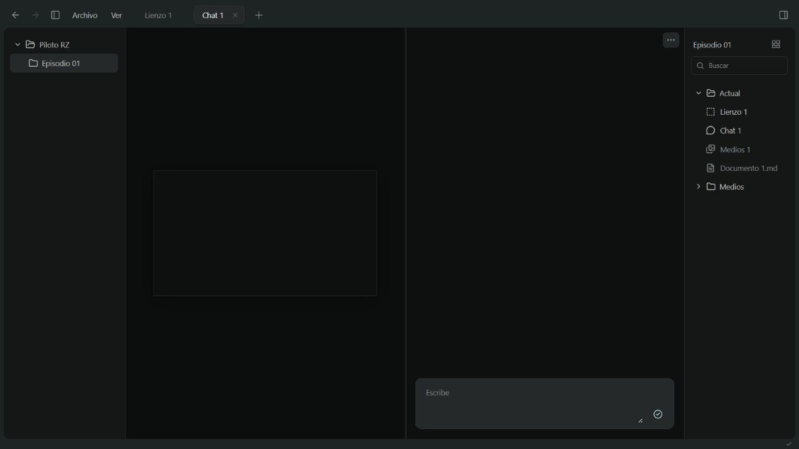
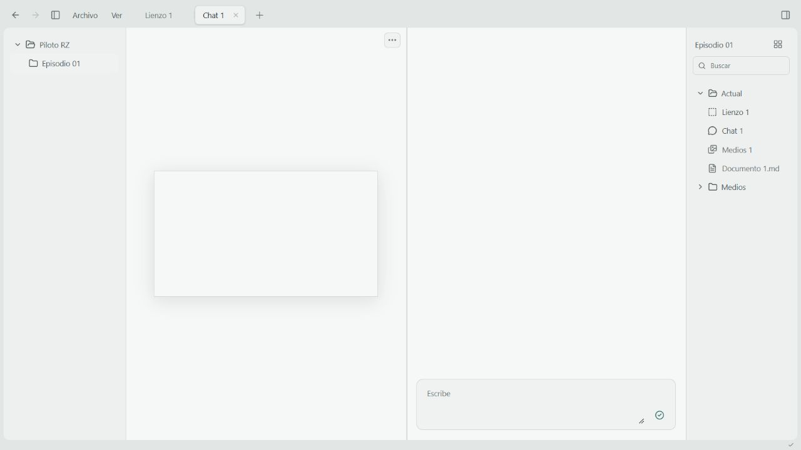
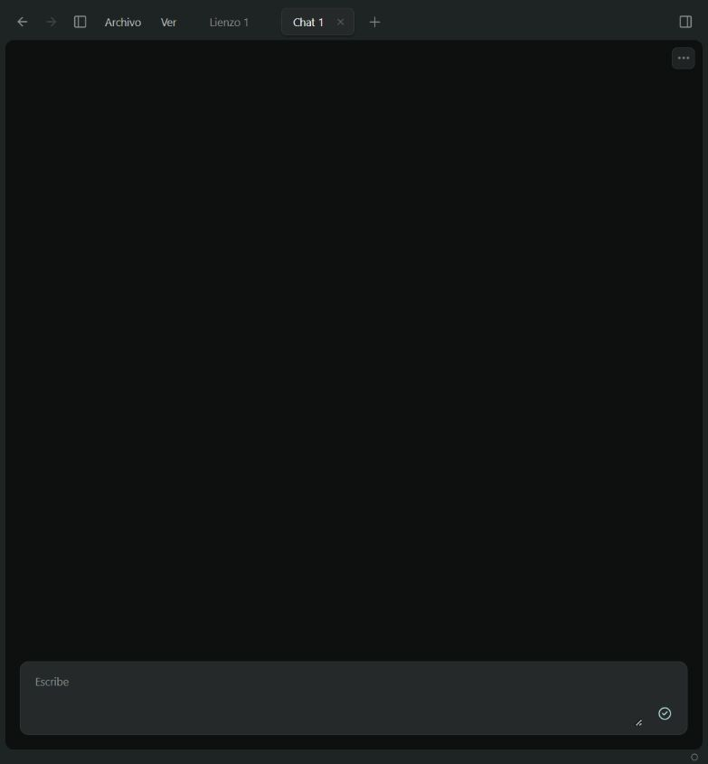

# Entrega 002 · Afinar la mesa

30 de septiembre de 2026. Dirección: feedback del usuario sobre la primera entrega, su nota adjunta y la referencia visual de Codex. La captura suministrada se usó como referencia; no se publicó en el repositorio.

## Resultado

El encabezado ahora contiene navegación, los menús funcionales Archivo/Ver, una sola cinta de pestañas y los interruptores de los laterales. Se retiraron marca, título del espacio, segunda barra de módulos, subtítulos, pies de módulo y textos de demostración. El marco pasa de radio 20 a 10 px; su margen exterior es 6 px y el pie ocupa 16 px.

Las pestañas inactivas se integran en el fondo, con separadores finos. La activa tiene texto más legible, borde y sombra discretos. La X se atenúa y aparece con el foco o el hover. El + abre una vista vacía con las cuatro herramientas y los documentos cerrados; elegir una herramienta transforma esa misma pestaña. Cerrar una vista conserva el contenido.

Cada división contiene únicamente su herramienta. El menú de tres puntos permite minimizar, separar, agrupar, abrir otra vista, flotar o ampliar. Pantalla completa puede aplicarse a la mesa o a un panel; al salir se recuperan sus divisiones. Se solicita además la pantalla completa del navegador cuando este la admite. Arrastrar una pestaña de la cinta hacia el centro de un panel agrupa; hacia sus bordes divide. Los menús ofrecen la alternativa al arrastre.

Los laterales muestran proyecto/episodio y los archivos de Actual/Medios. Se intercambian mediante las flechas del separador o Ver. Su ancho es regulable y arrastrarlos hasta el borde los oculta; el icono del encabezado los vuelve a abrir. Los archivos se abren con doble clic o Enter y pueden arrastrarse a un panel. La cuadrícula y el filtro consultan los mismos documentos.

La burbuja es una cinta móvil, sin título ni pie adicional. Comparte el borrador del chat activo y permite pasar a su panel sin crear otro chat. Su posición se conserva, se mantiene dentro de la pantalla y también puede moverse con las flechas del teclado. La posición inicial se centra en el panel de trabajo.

El oscuro llega ahora a fondos casi negros, manteniendo el exterior ligeramente más claro. Se conservaron claro/oscuro, intensidad, tonalidad y perfil de entrada. Menús y burbuja utilizan superficies translúcidas, desenfoque y sombras moderadas. Los controles táctiles mantienen objetivos de 44 px; los del ratón son más compactos.

## Biblioteca y método

Se incorporaron solamente las primitivas necesarias de [Radix Dropdown Menu](https://www.radix-ui.com/primitives/docs/components/dropdown-menu) 2.1.24 y Popover 1.1.23: foco, teclado, cierre y posicionamiento. El aspecto procede de tokens propios. Dockview sigue distribuyendo paneles; sus encabezados por grupo se ocultan con la API pública. La cinta común y sus acciones se implementan en el anfitrión. No se añadieron fondos multimedia ni animaciones de presentación.

## Piloto en disco

Ubicación local, fuera del repositorio de aplicación:

`C:\Users\Ramon\Documents\CODEX GPT PROYECTOS Rz\CANVA-Rz\Proyectos\Piloto-RZ\Episodio-01`

- `Actual/`: registros JSON del contenido; documentos y borradores de chat también en Markdown.
- `Medios/`: carpeta real preparada, todavía sin catálogo de recursos importados.
- `project.json`: contenido, vistas, preferencias y distribución del piloto.
- `project.previous.json`: manifiesto anterior recuperable.

El adaptador guarda después de una pausa breve y confirma solo tras la respuesta de escritura. Cada archivo se sustituye mediante un archivo temporal y rename; el manifiesto se escribe al final. El navegador conserva inmediatamente el borrador, incluso si la escritura local falla. Reabrir recupera el proyecto; un borrador pendiente del navegador tiene prioridad para evitar perder la última edición.

La revisión entre ventanas combina cambios que no compiten y conserva contenido más reciente cuando otra ventana solo cambia su interfaz. Dos ediciones diferentes del mismo contenido provocan un conflicto explícito y conservan el borrador para recuperación. Esto no constituye un editor colaborativo en tiempo real.

Este es un adaptador pequeño para el piloto, servido por Vite en desarrollo y preview. Todavía no permite elegir cualquier carpeta, observar modificaciones externas, importar archivos ni trabajar con proyectos múltiples. Los Markdown son el espejo de lo escrito desde la aplicación; editar esos archivos desde otra aplicación no los reimporta todavía. Los datos del piloto quedan fuera de GitHub.

## Comprobación

Compilación TypeScript/Vite correcta. Catorce pruebas de flujos y persistencia: cierre/reapertura, minimización, revisiones compartidas, búsquedas independientes, distribución, arrastre desde la cinta, burbuja, laterales, temas/táctil, pantalla completa, fallos de escritura y conservación entre ventanas. Se comprobó también que el guardado de otra ventana no elimina un borrador pendiente de recuperación. Las pruebas de interfaz aíslan el endpoint del piloto; las de disco utilizan una carpeta temporal independiente.

Revisión visual del marco real en oscuro y claro a 1280 × 720, y en 783 × 844. La prueba automatizada cubre 1440 × 900 y 390 × 844 con controles táctiles. Se restableció el viewport del navegador al terminar. Falta probar gestos en iPad físico. Vite mantiene una advertencia de tamaño del bundle; no impide compilar ni ejecutar.

## Continuidad

Checkpoint: `base-002`, en main del remoto autorizado. El siguiente tramo debe partir de tu uso de este marco: afinar gestos que sigan molestando y luego completar selección/importación de carpetas y el lienzo mínimo. La generación, las capas y los proveedores permanecen pendientes.
